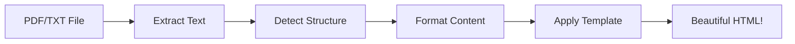

# 📚 Smart Notes Generator

> Transform boring PDF lecture notes into beautiful, interactive HTML study materials with automatic smart formatting!

[]()
[]()
[]()

## 🎯 What Does This Do?

**Smart Notes Generator** reads PDF or text files and automatically creates beautiful, interactive web pages with:

- 🎨 **Modern glassmorphism design** (dark theme with frosted glass effects)
- 🔵 **Auto-detected definitions** (highlighted in blue boxes)
- 🟡 **Auto-detected theorems** (highlighted in yellow boxes)
- 📑 **Chapter tabs** (automatically created from your content)
- 📱 **Mobile responsive** (works on any device)
- ✨ **Interactive animations** (smooth transitions and effects)

## 🚀 Quick Start (For Beginners)

### 1. Install Python Requirements

```bash
pip install -r requirements.txt
```

### 2. Run the Application

```bash
python run.py
```

### 3. Open in Browser

Go to: **http://localhost:5000**

### 4. Upload Your File

- Drag & drop a PDF or TXT file
- Click "Generate Smart Notes"
- Download your beautiful interactive notes! 🎉

## 📁 Project Structure (Easy Navigation)

```
smart-notes/
│
├── 📂 src/                         # Application code (the main program)
│   ├── app.py                      # Main Flask application
│   ├── routes.py                   # Web page handlers
│   ├── config.py                   # Settings
│   ├── templates/                  # Web interface
│   │   └── index.html             # Upload page
│   └── converter/                  # The "brain" (PDF → HTML)
│       ├── pdf_to_html.py         # Main conversion logic
│       ├── exceptions.py          # Error types
│       ├── utils.py               # Helper functions
│       └── smart_template.html    # Pretty HTML template
│
├── 📂 tests/                       # Automated tests (47 tests!)
│   ├── test_converter.py          # Tests conversion logic
│   ├── test_utils.py              # Tests helper functions
│   ├── test_routes.py             # Tests web interface
│   └── conftest.py                # Test setup
│
├── 📂 data/                        # Sample files to try
│   ├── sma103_text.txt            # Sample text file
│   └── 0programming paradigms.pdf # Sample PDF file
│
├── 📂 examples/                    # Example outputs (open these!)
│   ├── Calculus1 smart notes.html # See what the output looks like
│   ├── Calculus AI.html
│   └── Generated_Smart_Notes.html
│
├── 📂 docs/                        # Documentation
│   └── ARCHITECTURE.md            # Technical architecture
│
├── 📄 run.py                       # ⭐ START HERE! Main entry point
├── 📄 requirements.txt             # Python packages needed
├── 📄 requirements-dev.txt         # Development tools
└── 📄 README.md                    # This file!
```

**💡 Tip:** Each folder has its own README.md file explaining what it contains!

## 💻 Usage

### Web Interface (Easiest!)

1. Start the server: `python run.py`
2. Open: http://localhost:5000
3. Upload a file and convert!

### Command Line (For Advanced Users)

```bash
python src/converter/pdf_to_html.py your_notes.pdf
```

Output will be saved as `Generated_Smart_Notes.html`

## 🧪 Testing

### Run All Tests

```bash
pytest
```

### Run Specific Tests

```bash
pytest tests/test_converter.py     # Just converter tests
pytest -v                           # Verbose output
pytest -m unit                      # Just unit tests
```

**Current Status:** ✅ 47 tests passing

## 🎨 Features

### Auto-Detection Magic

The converter automatically finds and formats:

```
Definition: A function is...    →  🔵 Blue definition box
Theorem: All sets are...         →  🟡 Yellow theorem box
Example: Consider x = 5          →  📝 Styled example box
Chapter 1: Introduction          →  📑 Creates a new tab
```

### Beautiful Design

- **Glassmorphism UI** with dark theme
- **Smooth animations** on tab switches
- **Color-coded content** for easy studying
- **Mobile-friendly** responsive layout

## 🔧 For Developers

### Architecture

- **Application Factory Pattern** - Clean, testable Flask app
- **Blueprint Organization** - Modular route handling
- **Type Hints** - Full type coverage for clarity
- **Custom Exceptions** - Detailed error messages
- **Comprehensive Tests** - 47 automated tests

See [docs/ARCHITECTURE.md](docs/ARCHITECTURE.md) for technical details.

### Code Quality

```bash
# Format code
black .

# Check style
flake8 .

# Type checking  
mypy src/
```

## 📖 How It Works



1. **Extract** - Read text from PDF or TXT file
2. **Detect** - Find definitions, theorems, chapters using regex
3. **Format** - Wrap content in styled HTML
4. **Template** - Inject into glassmorphism design
5. **Output** - Interactive study material! 🎉

## 🌟 Examples

Check out the `examples/` folder to see what the output looks like! Just open any `.html` file in your browser.

## 📝 Requirements

- **Python 3.7+**
- **Flask** - Web framework
- **pypdf** - PDF text extraction
- **chardet** - Encoding detection

Install all with: `pip install -r requirements.txt`

## 🎓 Perfect For

- 📚 Students converting lecture notes
- 👨‍🏫 Teachers creating study materials
- 📖 Anyone who wants beautiful, interactive notes

## 🤝 Contributing

This project follows standard Python/Flask best practices:

1. Fork the repository
2. Create a feature branch
3. Write tests for your changes
4. Ensure all tests pass (`pytest`)
5. Submit a pull request!

## 📄 License

Created by [@mr-ceo7](https://github.com/mr-ceo7)

## 🎯 Pro Tips

- **Tip 1:** Use the web interface for one-off conversions
- **Tip 2:** Use command line for batch processing
- **Tip 3:** Check the `examples/` folder to see output samples
- **Tip 4:** Read folder README files to understand the structure
- **Tip 5:** Run tests before making changes (`pytest`)

---

**Happy Learning!** 🚀📚✨
